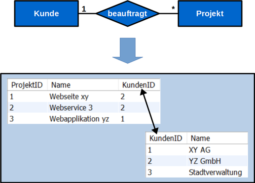
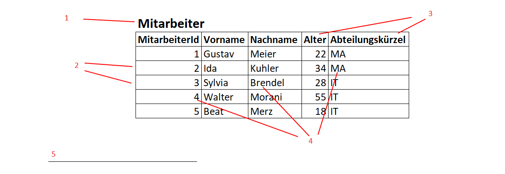

1. Welche Stufen gibt es bei der Wissenstreppe? 
Nennen Sie diese der Reihe nach und machen Sie ein Beispiel mit einem Wechselkurs.

    1. Zahlen 1-9 A-Z
    2. Daten 1.1.2022
    3. Information Geb. Datum
    4. Wissen Person => Geb. Datum
    5. Kompetenz Man kann zum Geburtstag gratulieren

2. Wie werden Netzwerk-Beziehungen im logischen Modell abgebildet?

3. Was sind Anomalien in einer Datenbasis? Welche Arten gibt es?

Abweichungen
Ausreisser
Musterbrücke
leere Felder

4. Gibt es redundante "Daten"? Warum?

5. Datenstrukturierung:  Welche zwei Aspekte können strukturiert werden?  Welche Kategorien (Abstufungen) gibt es bei der Strukturierung?  Und wie müssen die Daten in einer DB strukturiert sein?

6. Beschreiben das Bild mit den richtigen Fachbegriffen 

7. Welche (einschränkende) Einstellungen zu den Attributen (z.B. ID) kennen Sie?  